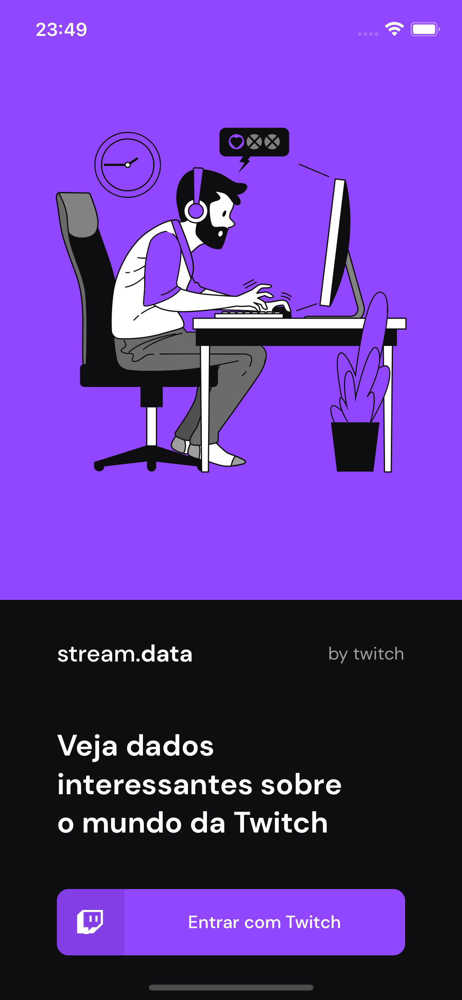
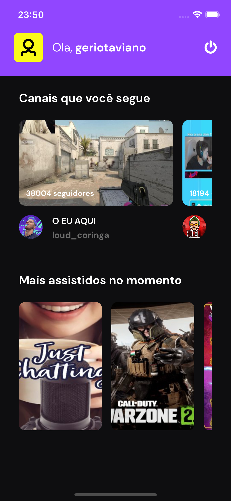

<h1>Twitch App </h1>

<h4>
This is an mobile app to list your favorite Twitch streamers.
</h4>

</br>

<p align='center'>


</p>

</br>

<div align='center'>
  
  
</div>

</br>

## Tecnologies 🚀

This app uses social login with Twitch integration API and expo authentication session

- Expo SDK 47
- Expo Auth Session
- Expo Fonts
- Twitch API
- Styled Components
- Axios
- React Context API

</br>

## How to use ? 🤔

- First, you must create an application in the Twitch developer interface
    - [documentation Twitch](https://dev.twitch.tv/docs/authentication/getting-tokens-oauth#implicit-grant-flow)
- Add client id and redirect url in your .env file
    - example redirect url: https://auth.expo.io/@user-expo-name/app-name
- Install dependencies

```bash
  # install expo-cli
  sudo npm install — global expo-cli

  # clone this repository
  git clone https://github.com/Natan10/twitch-app

  # enter in twitch-app
  cd twitch-app

  # install dependencias
  npm install or yarn install

  # start application
  expo start
```


